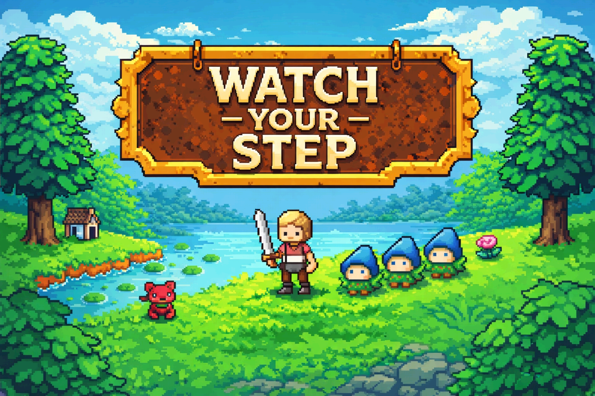

<iframe frameborder="0" src="https://itch.io/embed/4165281?linkback=true&amp;border_width=4&amp;dark=true" width="558" height="173"><a href="https://dmitriieremin.itch.io/watch-your-step">Watch Your Step by dmitrii.eremin</a></iframe>

**Watch Your Step** is a fun and accessible arcade–puzzle game set in a lively forest world.

Small mushroom kids are lost all over the world, and it is your task to find them and guide them safely back home. Once collected, the mushrooms will follow you in a growing chain as you explore the environment. Lead them carefully to their home—but every step matters.

If you accidentally step on one of the mushrooms, it will explode, causing the entire chain behind it to panic and run back into the forest. When that happens, you will need to track them down and collect them again. Precision and planning are key.

The forest is also home to various animals that pose additional challenges. Mushrooms are afraid of them, so you must navigate wisely to keep your group together and moving forward.

With simple controls, charming mechanics, and a mix of fast-paced arcade action and thoughtful puzzle elements, Watch Your Step is easy to pick up and hard to put down. Guide the mushrooms, avoid danger, and bring everyone home safely.

Try it — and watch your step.